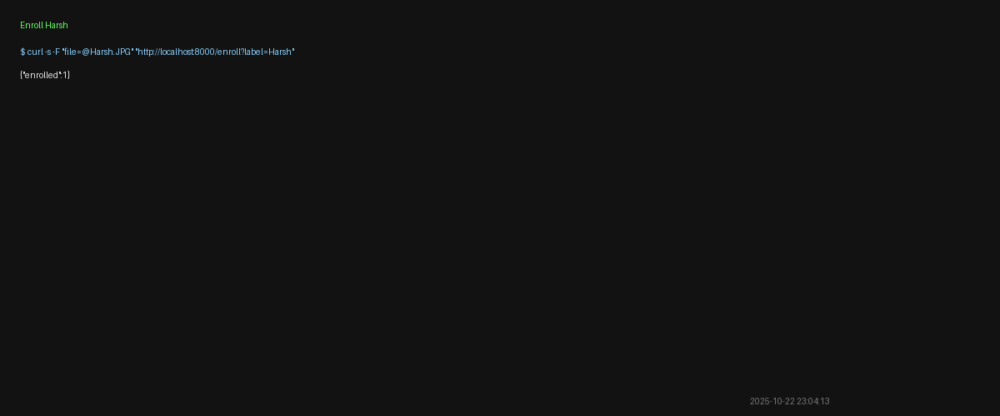
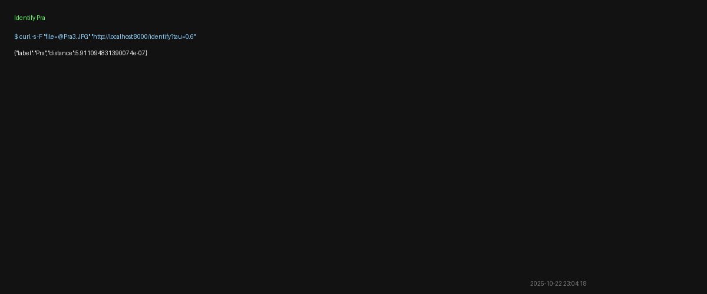
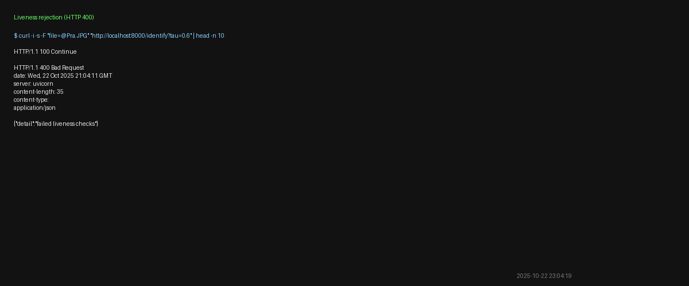
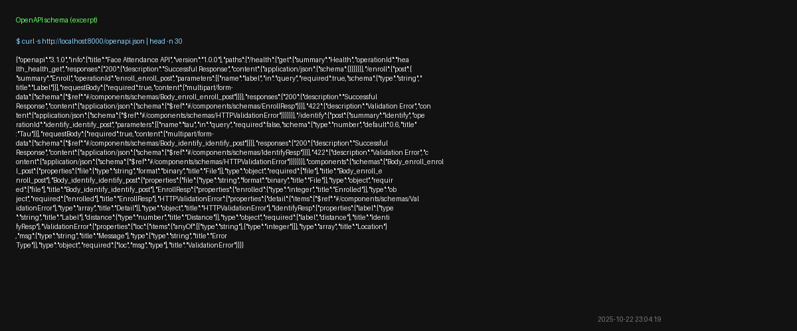

# Face Attendance API (FastAPI + `face_recognition`) — with Basic Anti-Spoofing


> A small, production-shaped microservice that **enrolls** faces and **identifies** people from images using 128-D embeddings. It does **open-set** verification with a distance threshold **τ** (returns `unknown` if above τ) and **basic anti-spoofing** to block obvious screen/print attacks.
> **Disclaimer:** Demo project — not for security-critical use.

---

## What this does

* **`/enroll`** — extract face embeddings and store them in SQLite under a label (e.g., `Harsh`).
* **`/identify`** — compare a new image to the DB and return `{ label | "unknown", distance }` using threshold **τ**.
* **Anti-spoofing** — rejects images that look like screens/prints via glare saturation + Laplacian variance heuristics.
* **Ops shape** — FastAPI app, pinned deps, a health test (`pytest`), and CI.

---

## Repo layout 

```
app/                 # FastAPI service code
  __init__.py
  main.py            # routes: /health, /enroll, /identify
  recog.py           # embeddings + nearest-match
  store.py           # SQLite persistence (embeddings only)
  liveness.py        # simple anti-spoofing heuristics
  schemas.py         # response models
tests/
  test_health.py     # basic health test
data/
  embeddings.sqlite  # created at runtime
Dockerfile
Makefile
requirements.txt
# Example images + screenshots (in repo root)
Harsh.JPG Harsh2.JPG Harsh3.JPG Pra.JPG Pra2.JPG Pra3.JPG
ss-01-health.png ss-02-enroll.png ss-03-identify-harsh.png
ss-04-identify-pra.png ss-05-liveness-400.png ss-06-db.png
ss-07-openapi.png ss-08-docker.png
```

---

## Quickstart (local)

```bash
python3 -m venv .venv && source .venv/bin/activate
pip install -r requirements.txt

# (macOS convenience for tests/imports)
export PYTHONPATH="$(pwd)"

# run API
uvicorn app.main:app --host 0.0.0.0 --port 8000 --reload
```

Health check:

```bash
curl -s http://localhost:8000/health
# {"status":"ok"}
```

Run tests:

```bash
pytest -q
```

Swagger / OpenAPI:

* Docs UI: [http://localhost:8000/docs](http://localhost:8000/docs)
* OpenAPI JSON: [http://localhost:8000/openapi.json](http://localhost:8000/openapi.json)

---

## API

### POST `/enroll?label=<name>`

* **Body:** multipart form with `file=@image.jpg|png`
* **Response:** `{ "enrolled": N }` (faces found)
* **Errors:** `400 "failed liveness checks"` · `400 "no face detected"`

### POST `/identify?tau=0.6`

* **Body:** multipart form with `file=@image.jpg|png`
* **Response:** `{ "label": "<name|unknown>", "distance": <float> }`
* **Note:** tune **τ** for your gallery (typical 0.50–0.65)

**Examples**

```bash
# enroll Harsh
curl -F "file=@Harsh.JPG"  "http://localhost:8000/enroll?label=Harsh"

# identify Harsh
curl -F "file=@Harsh3.JPG" "http://localhost:8000/identify?tau=0.6"
```

---

## Demo 

<p align="center">
  
</p>

**Enroll & Identify**

<p align="center">
  
  <br/>
  
  <br/>
  
</p>

**Anti-spoof (basic liveness)**

<p align="center">
  
</p>

**State & API schema**

<p align="center">
  
  <br/>
  
</p>

*(If you use Docker, keep `ss-08-docker.png` here as well.)*

<p align="center">
  
</p>

---

## How it works (at a glance)

```
[Client] --multipart--> [FastAPI]
   └─ basic_antispoof()   → reject obvious spoofs (glare / low texture)
      face_recognition    → 128D face embedding
      SQLite store        → embeddings only (no raw images)
      open-set match (τ)  → nearest label if distance ≤ τ, else 'unknown'
```

---

## Evaluation (minimal)

1. Build a tiny gallery (2–5 people, 2–3 images/person).
2. Sweep **τ** to trade off **TPR vs FAR**; target **TPR@FAR≈0.1%** for the demo set.
3. Note p95 latency and liveness rejection on screen/print photos.

---

## Privacy & Limits

* Stores **embeddings only** (delete a label’s rows to remove a user).
* Heuristic liveness only (not production-grade).
* HOG detector struggles in low light/pose; switch to `"cnn"` if you have a CUDA dlib build.

---

## Troubleshooting

* **`failed liveness checks`** → avoid screen photos; use real camera images in normal lighting.
* **`no face detected`** → face too small/profile/occluded; try a clearer frontal image.
* macOS HEIC → convert: `sips -s format jpeg input.HEIC --out fixed.jpg`
* Import path on macOS: `export PYTHONPATH="$(pwd)"` (run from repo root).

---

## Roadmap

* `/list` & `/delete?label=` endpoints
* `/metrics` (uptime, request counts, avg latency)
* Minimal upload page at `/` (for non-CLI demo)
* Swap SQLite → **FAISS** for large galleries (>10k embeddings)

---

## What I built (Harshit Lakum)

* Designed **open-set** API (`/enroll`, `/identify`) with clean error handling
* Implemented **basic anti-spoofing** heuristics
* Built **SQLite** embedding store, **pytest** test, and **CI**
* Documented privacy, limits, and threshold tuning

---


